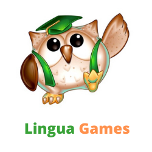

**README.md**

  

**LinguaGames**

  

**Contents**  

1.  UX Development

2.  Project Goals
3.  UX Requirements
4. Developer's goal
5.  Users
6.  User Goals
7.  User Stories
8.  Design Choices

		- Fonts;
		- Icons;
		- Colours;
	 	- Features & Future Releases;
	 	- Technology used;

10.  Testing

11.  HTML and CSS check using WC3
12. Peer Code Review
13. User stories
14. User testing

15.  Bugs and De-bugging

	  - Known Issues

16.  Project Deployment

17.  Deployment
18.  Creating a Local Version

19.  References
20.  Acknowledgements
 
====

**1. UX Development**

Language based memory game will help users to learn a new language in the relaxed, entertaining way.
  
As user, I have never enjoyed playing games that do not have a purpose. Therefore, as a developer, I have decided to create the game that will help purpose and will make users interested to play a game and to learn a new language.

The primary goal of the website is to make learning fun and inspire users to return to the game, as they progress.

Playing memory games can improve other brain functions, such as attention, concentration, and focus. Memory games give space to critical thinking and that helps children nurture their attention to detail. Memory games can improve visual recognition.

**2.Project goal**

The purpose of this project to create website to enable consumers to have fun interactive experience in learning of the new words. 
The website has to be easy to navigate with clear purpose of the buttons and screen space. The game has to provide the clear and safe framework for clients and to make the experience casual rather than requirement.
 

**3. UX requirements**

The website targets the individuals interested to learn or improve the knowledge of the foreign languages in the casual way, through the game experience. Present level of development offers only fail/win notification. Please see future implementations plan for more details of  users progress measurement.

**4. Developer's Goals**

The site owner has the following goals:

-   To provide users with interactive and easy navigation learning process.
-   To encourage users to learn more 
-   To provide platform with colours and fonts stimulating users experience.
- To give users control over the game, by choosing of the language, initiating and resetting the game and timer.

**5. Users:**

 Individuals interested to learn a new language with no age limitation.

**6. User goals:**
Person interested to learn basics of the new language has to learn  300-600 words to be to travel and 1000 words to be able to converse;
the users goals is to identify application allowing them to have access to the application teaching them the most common words used in any language. Therefore, i have used the most common words used in English language
 

**7. User Stories**

 **- First Time Visitor Goals:**
1.  As a first time visitor to the website, I want to easily understand the main purpose of the game.
2. As a first time visitor navigate through the game
3.  As a visitor I want to have a clear rules, how to play.
4.  As a visitor want an easy way to contact developer.
5.  As a returning visitor to the website, I would like to have a choice of languages to learn or improve

 **- Returning Visitor Goals:**
 
1.  As a Returning Visitor I would like to find more languages available and more difficulty levels.
2. As a Returning Visitor I would like to find social community links.

**- Frequent Visitor Goals:**
	1.	As a Frequent Visitor i would like to see more challenges and alternative way of learning languages
	2.	As a Frequent Visitor I would like to see better way to interact with the game.
	3.	As a Frequent Visitor I would like to see competing board and possibility to compete with other players and friends.
	
  
**8. Design Choices**

When designing website I took inspiration for colours and fonts from the game Memory. The application is using colours and fonts scientifically proven to help users to learn and stimulate their cognitive functions.

**Fonts**

I have used Google Fonts to determine the best fonts suitable for each part of the website, I.e. Logo, Menu and Body information.

I opted to use Open Sans font for my website, which is one of the most popular fonts used by major internet companies.

[https://nestify.io/blog/top-10-best-google-fonts/](https://nestify.io/blog/top-10-best-google-fonts/)

**Icons**

Icons used where provided by [icon8](https://icon8.com/), used in moderation and are self explanatory.

**Colours**

The colours were determined by the pallet of Cooler website:

-   For navbar and contact modal I used linear gradient of 
rgb(5,  57,  97),
and
rgb(10,  105,  177);

-   For body background: rgb(55,  149,  93).

**Features**

View my wireframes [here](wireframes.md).
It's one-page website with  a number of modal windows. I used JS to hide windows and information to make sure users are not distracted by excessive information on the page.
I placed only fixed navigation bar  with Logo and menu, linking user to the rules of the game and contact modal, and cards to play with.

Translation API that translates seamlessly behind the scene  English words into three languages. More languages can be implemented at any time

Features to implement:
- To add bigger choice of languages;
- To increase number and difficulty of words;
- To create competition board.
- To create virtual badges, stars and list of words learn during the session to measure the learning process.
- To add links to social media to enable users to share their achievements.

**1.9. Technologies Used**

  
**UX/UI design**

-   [Figma](https://figma.com/)

**Languages**

-   [HTML](https://developer.mozilla.org/en-US/docs/Web/HTML)
-   [CSS](https://developer.mozilla.org/en-US/docs/Web/CSS)
[JavaScript](https://developer.mozilla.org/en-US/docs/Web/JavaScript)
  
**Tools & Libraries**

-   [Git](https://git-scm.com/)
-   [Bootstrap](https://getbootstrap.com/)
-   [Icon8](https://icon8.com)
-   [Google fonts](https://fonts.google.com/)
-   [Figma](https://figma.com/)
- [Icons8](https://icons8.com/icon/NHEVr1Qkidu0)
- [Canva](https://canva.com/)
- [RapidApi](https://rapidapi.com)
  

**2. Testing**

First time testing. I used an online tool, using ami.responsivedesign.is and [Screenfly](https://bluetree.ai/screenfly/) website to test website on various devices.

I’ve tested the CSS with [CSS Validator](http://jigsaw.w3.org/css-validator/) which told me that there were mistake in different browsers attributes, which I removed.

    

The HTML I’ve tested with [HTML Validator](https://validator.w3.org/) which gave me the positive results.

JS was tested on [JSHint](https://jshint.com/)
  and missing semi columns fixed. Also as per Stack Overflow recommendations added /*jshint esversion: 6 */ at the top of JS folder.

**Responsiveness**

 I tried CSS Grid but eventually opted to use **Bootstrap** and Flexbox throughout the project to ensure **maximum** responsiveness.

[Google Mobile-Friendly Test](https://search.google.com/test/mobile-friendly) -

[The verdict is the page is mobile friendly.](
https://search.google.com/test/mobile-friendly?id=o_8w7MX19q9LWdko_LifTg)

**3. Bugs and Debugging**

During testing I found that all iOS users encountered a display glitch where the front-face cards do not show when the user touches a card to flip. Instead it momentarily displays the image then flips to the inverted back face card.
no such problem was found on Galaxy devices.

**4. Version Control**

 -   Used Git for version control.
 -   Branches were created to work on alternative grid layout.
 -   The branches were then merged with the master branch after any conflicts were addressed.

**4. Project Deployment**

I built website using **gitpod** and **GitHub** to host the repository.

To deploy the website using **GitHub Pages** the following steps have to be made:

-   Opened up and log in **GitHub** in the **browser**.
-   Selected my [repositories](https://github.com/alexeykuz-sys?tab=repositories).
-   Navigated  and open project to [MS2_LinguaGames_Project](https://github.com/alexeykuz-sys/MS2_LinguaGames_Project)
-   In the top navigation clicked **settings**.
-   Scrolled down to the **GitHub Pages** area.
-   Selected **Master Branch** from the **Source** dropdown menu.
-   Clicked to **confirm** my **selection**.

  

**You can run the project locally, in which case you have to follow the following steps:**

**To clone this project from GitHub:**
1. You can paste the repository link directly into any editor you use with the command 'git clone'. For example:

Type git clone and paste https://github.com/alexeykuz-sys/MS2_LinguaGames_Project.git

 
**5. Credits**

** Media**

The image for a game logo was taken from internet.
 **Code**

I used various YouTube and website to get ideas and logic of the game.
[Memory Game](https://medium.com/free-code-camp/vanilla-javascript-tutorial-build-a-memory-game-in-30-minutes-e542c4447eae)
and
[How to build memory game](https://scotch.io/tutorials/how-to-build-a-memory-matching-game-in-javascript)

[Timer](https://css-tricks.com/how-to-create-an-animated-countdown-timer-with-html-css-and-javascript/)

**6. Acknowledgements**
I would like to thank:

-   My mentor,  Femi for his guidance and advice on this project before submission.
-   Bim Williams  for his support and guidance.
-   Slack Community  for always being on-line to answer the questions and give moral support

**Disclaimer**

The content on this website is for the purpose of this project only.
<!--stackedit_data:
eyJoaXN0b3J5IjpbLTQ2OTY3Mjc4NywtMjk4MTY2OTY2LC0yMD
c0NjI5OTkzLDY2MTE2OTE0MiwxMjc5NDM1MzE3LDE4MDQ0MTgz
NDUsLTQ0OTIxNDc4LDEwNzA5MjM3NTYsMTg5NzEwNzM3MCwyMT
IxNTE3MzAwLC0xOTYwNDcxMTczLC0xOTE3NzQ2MTQ1LC0xOTY2
Nzk5NjI0LC0xODc3ODMxMDU5LC04MDU5NDEyNTEsLTUzNjAzNT
kxMCwtMTY0Nzc1ODQyLC0xOTA0MzY2NzcxLC0xNjA1MTQ3MTE2
LDg1NDU3NzE5Ml19
-->